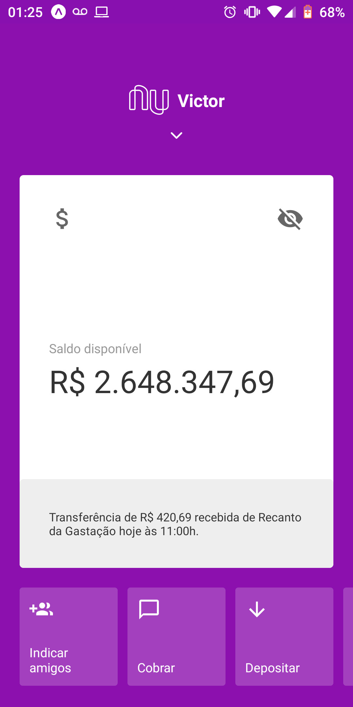
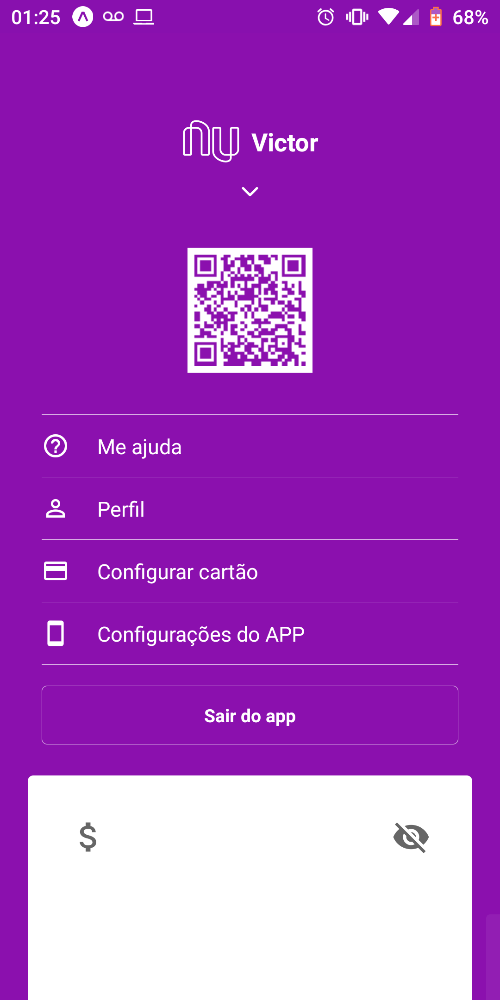
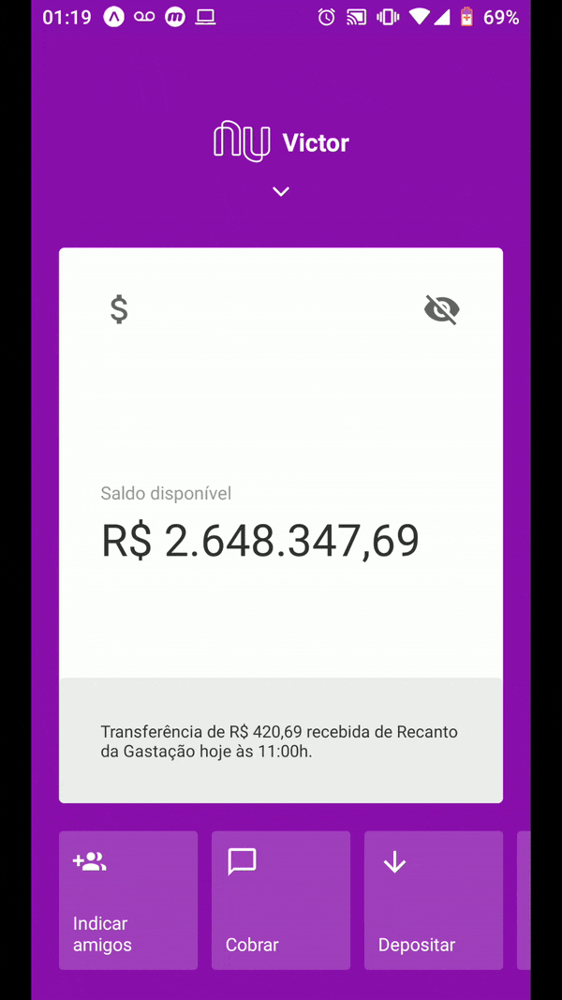

<h1 align="center">
  
</h1>

<h3 align="center">
  nuClone: a Nubank App clone!
</h3>

<p align="center">
  
  
  
   
  
  <a href="https://github.com/mlg404/nubank-clone/commits/master">
    
  </a>
  
  <a href="https://github.com/mlg404/nubank-clone/issues">
    
  </a>

  <a href="https://github.com/mlg404/nubank-clone/blob/master/LICENSE">
     
  </a>
</p>

<p>This is a clone application made for study purposes, where i developed an Mobile application following the original Nubank layout</p>

<p align="center">
  <a href="#rocket-info">Info</a>&nbsp;&nbsp;&nbsp;|&nbsp;&nbsp;&nbsp;
  <a href="#computer-technologies">Technologies</a>&nbsp;&nbsp;&nbsp;|&nbsp;&nbsp;&nbsp;
  <a href="#information_source-how-to">How to</a>&nbsp;&nbsp;&nbsp;|&nbsp;&nbsp;&nbsp;
  <a href="#mag_right-functionalities">Functionalities</a>&nbsp;&nbsp;&nbsp;|&nbsp;&nbsp;&nbsp;
  <a href="#busts_in_silhouette-contribute">Contribute</a>&nbsp;&nbsp;&nbsp;|&nbsp;&nbsp;&nbsp;
  <a href="#memo-license">License</a>
</p>

<p align="center" style="display: flex; align-items: center; justify-content:center;">
  
  
  
</p>

## :rocket: Info

This is a React Native APP. Nubank is a digital bank, with best (or none) tax!

## :computer: Technologies

This project was developed following this technologies:

- [Expo](https://expo.io/)
- [React](https://reactjs.org)
- [React Native](https://facebook.github.io/react-native/)
- [Styled Components](https://styled-components.com/)
- [RN Reanimated](https://github.com/software-mansion/react-native-reanimated)
- [RN QRcode Generator](https://www.npmjs.com/package/react-native-qrcode-generator)
- [RN Gesture Handler](https://github.com/software-mansion/react-native-gesture-handler)
- [React Navigation](https://reactnavigation.org/)
- [VS Code][vc] 


## :information_source: How To

To clone this application you will need [Git](https://git-scm.com) + [Yarn v1.22.4][yarn] or higher + [Expo CLI][expocli] installed in your computer. Run in terminal:

```bash
# Clone this repo
$ git clone https://github.com/mlg404/nubank-clone.git nubank-clone

# Access this repo
$ cd nubank-clone

# Install dependencies
$ yarn install

# Run the application
$ yarn start
```

## :mag_right: Funcionalities

See the current features!
- See your money
- Swap down to see menu options
- Swap tabs 

## :busts_in_silhouette: Contribute

- Fork this repository;
- Create one branch with your feature: `git checkout -b my-feature`;
- Commit your alterations: `git commit -m 'feat: My new feature'`;
- Push to your branch: `git push origin my-feature`.

Open a pull request with your branch. After yout pull request merge, you should delete your branch.

## :memo: License
This project is under MIT license. See [LICENSE](https://github.com/mlg404/nubank-clone/blob/master/LICENSE) for more information.

---

Made with 💙 by Victor Eyer :wave: [Get in touch!](https://www.linkedin.com/in/victoreyer/)

[nodejs]: https://nodejs.org/
[vc]: https://code.visualstudio.com/
[expocli]: https://expo.io/tools